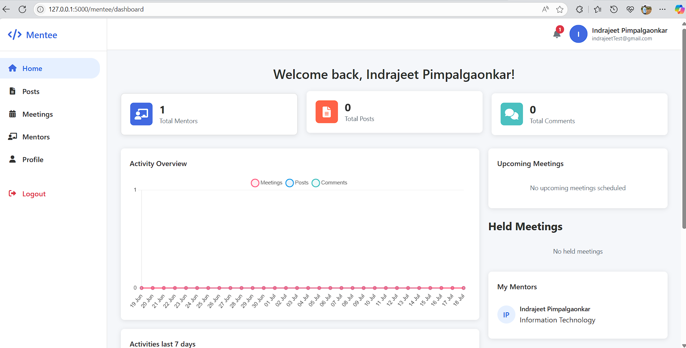

# 📬 Flask Web App - Mentor Connect 

A Flask-based web application with functionalities like user authentication, email communication, secure password storage, and more. This project is modular, clean, and ideal for learning or extending for production use.

---

## 🚀 Features

- 🔒 Secure user registration & login using hashed passwords
- 📧 Email sending functionality using Flask-Mail
- 💾 SQLite for lightweight data storage
- 🎨 Templating with Jinja2
- ⚡ Real-time feedback using Flash messages
- 📦 Session management
- 🔐 CSRF protection-ready structure

---

## 🛠️ Tech Stack

- Python
- Flask
- Flask-Mail
- SQLite
- HTML5, CSS3 
- JavaScript 

---

## ⚙️ Installation

1. **Clone the repo**
   ```bash
   git clone https://github.com/indrajeet-77/Mentor-Connect.git
   cd Mentor Connect
   ```
2. **Create a virtual environment**
```bash
python -m venv venv
source venv/bin/activate  # On Windows: venv\Scripts\activate
```
3. **Install dependencies**
```bash
pip install -r requirements.txt
```
4. **Run the app**
```bash
python app.py
```
---
## 🙋‍♂️ Author
Made with 💙 by Indrajeet Pimpalgaonkar

---
## 📸 UI Preview

### 👨‍💼 Admin Dashboard


### 👨‍🎓 Mentee View


### 📊 Mentor Dashboard


